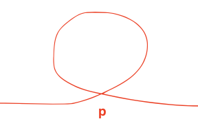
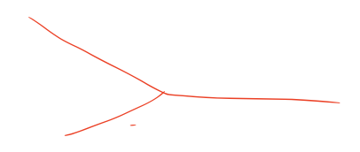
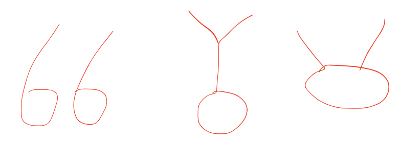

给定两个可能有环也可能无环的单链表，头节点head1和head2。请实现一个函数，如果两个链表相交请返回相交的第一个节点。如果不相交，返回null。
[要求]：如果两链表长度之和是N，时间复杂度要求 O(N)，额外空间复杂度O(1)。

1. 首先判断这两个链表是否有环，得到他们第一个入环的节点。判断方法：快慢指针

   - 快一次走两步，慢一次一步，若快指针走到链表末尾了，说明没有环

   - 若有环则快慢指针必会相交于环上一点A，此时将另一指针p指向head，让p和A同时一次走一步，相交的点就是入环的节点

​				注意：链表有环后不可能再出来如下图，因为 `p.next` 只能是一个节点。

2. 若一个有环一个没环，则必不相交，返回null
3. 若两个都没有环，若相交只能如下图

​			如图，若相交，则两个链表的末尾一定是同一个节点。

- 从头遍历得到两个链表的结尾end1 end2，如不相等说明不相交，返回null

- 若相等则拿到两个链表的长度差 n，让长的链表先从头走n步，之后同时走，相遇的节点就是入环处

  

4. 若两个都有环，有以下三种情况

​		从loop1(第一个链表的入环节点)开始沿着next走，若能遇到loop2，则说明是后两种情况，遇不到说明是第一种。

